## COMP3021 2020Fall Programming Assignment 2

In PA2, you will implement a GUI version of the game in PA1. The core logic of the game remains the same.

**Reminder**

- Please ask questions using "Issues" on this github repository in case other students have same questions.
- Add TAs as cooperators of your private GitHub repository.

    -  arabela_tso@outlook.com
    -  troublor@live.com
    


## Changes from PA1

- GUI's components are to be implemented with JavaFX, meaning that you will need to familiarize yourself with JavaFX classes
  and functionality
- The text version of Jeson Mor is still preserved, a new package `gui` is added under `src/main/java/castle.comp3021.assignment`
    - The entry point to the text game is now `src/main/java/castle.comp3021.assignment/textversion/Main`
    - The entry point to the GUI game is `src/main/java/castle.comp3021.assignment/gui/GUIMain`
    - You may still access the text game by using the `--text size numProtectionStep` argument when launching the GUI game
    - Please ensure that the text game is still playable after adding the GUI version!


## Environment

The same as PA1, using the following environments:

* Java `>= 14`
* Intellij IDEA (Community or Ultimate Edition) `>= 2020.2`
* Javafx 15 (No need to download it yourself, they are provided in the project).


## How to set up

The Javafx 15 sdk for different operation systems have been provided (`javafx-sdk-15-linux`, `javafx-sdk-15-osx`, `javafx-sdk-15-win-x64`, `javafx-sdk-15-win-x86`). 
You can remove sdks for other operation systems.

### Add Javafx SDK to library

- `File -> Project Structure`, navigate to `Libraries`

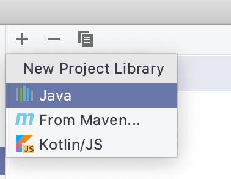

- Right click "+", and add `path-to-javafx-sdk/lib`

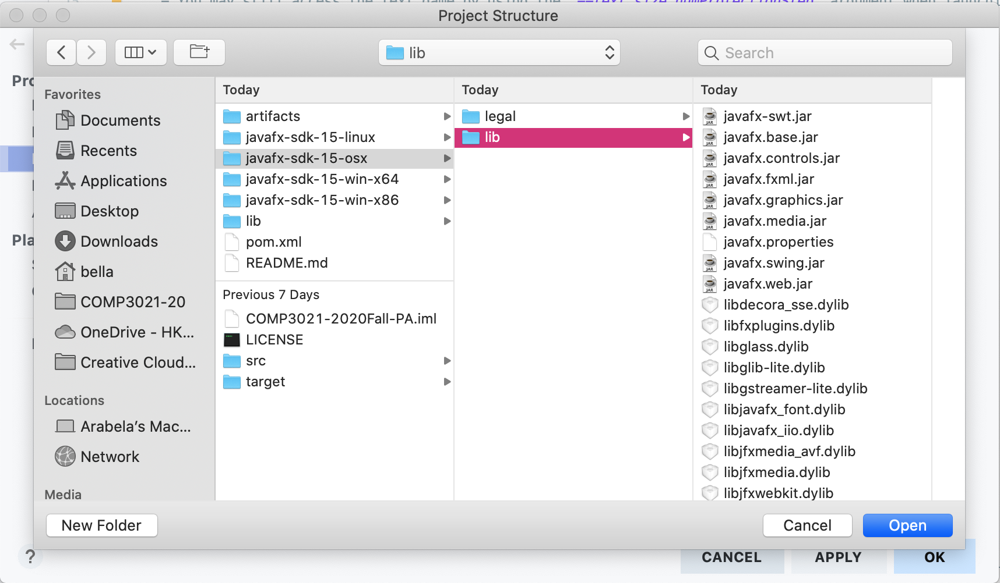

- Click `Open` and `Apply`.

\* *You can remove javafx sdks for other systems.*

Note: 

- Add `./lib` to Libraries if it is not automatically configured.

- After the above configuration, it is normal you **CANNOT** get the project run, because the functions related to show 
scenes and panes have not been implemented. 


## How it works

The GUI version of Jeson Mor is expected to provide three **main** functions in the main menu: 


### Function1. Game Play

#### A. Customized Game Configuration

Before entering the game, a customized setting should be provided. You can also use default setting for the configuration.

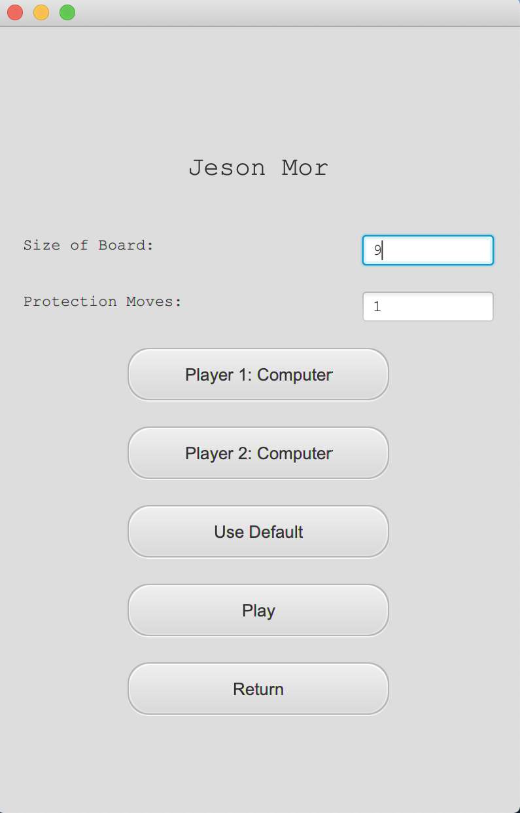

**Note:** **The role of players can be both computers, both humans or computer VS human.**

#### B. Launch the game

After setting up the configuration of game, clicking "Play" button will go to the main game play pane:


The configuration is the same as what you set in the previous pane. 


After clicking "Start" button, the game will start, the timer starts ticking.

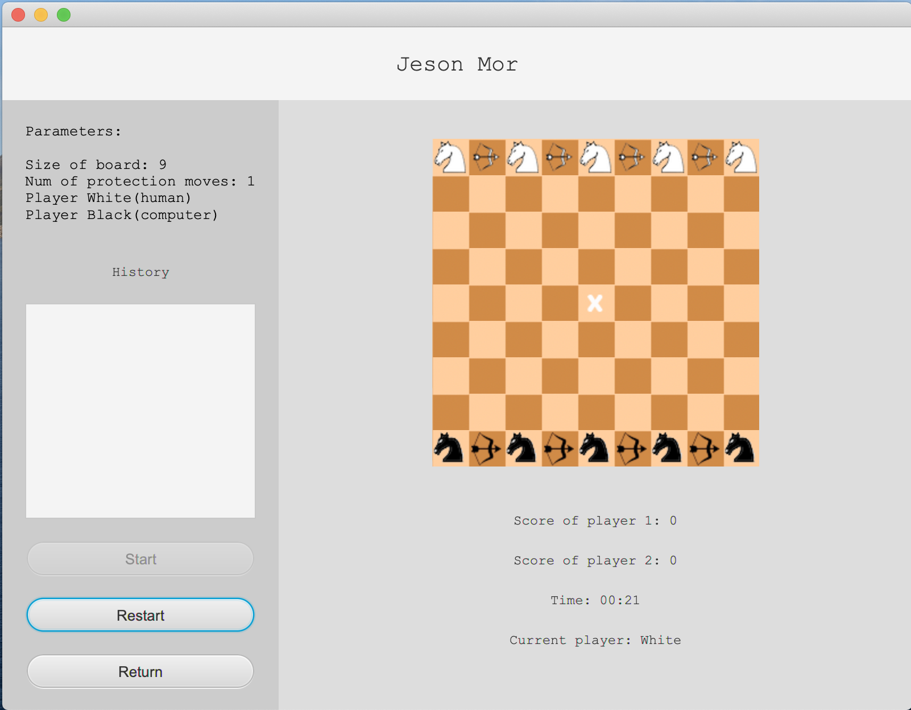


The human player moves the pieces by **clicking and dragging** on the board. The board that has been selected will be **highlighted**. 

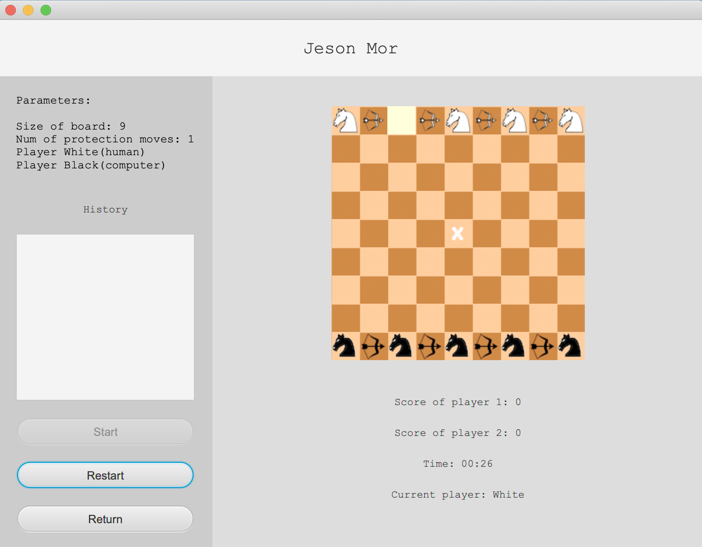


You can **restart** the game when playing.


#### C. Check validation of moves

If the move is invalid or not your turn, a warning window will pop up.

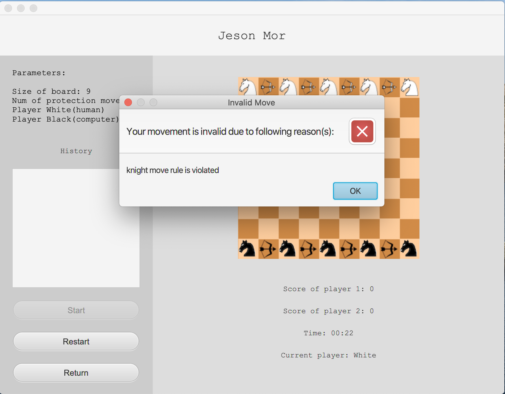


#### D. Time elapsed

There is a `Time:00:22` in the above figure, which shows the time elapsed.


#### D. Pop up winner

Pop up the window when **winner** comes out.

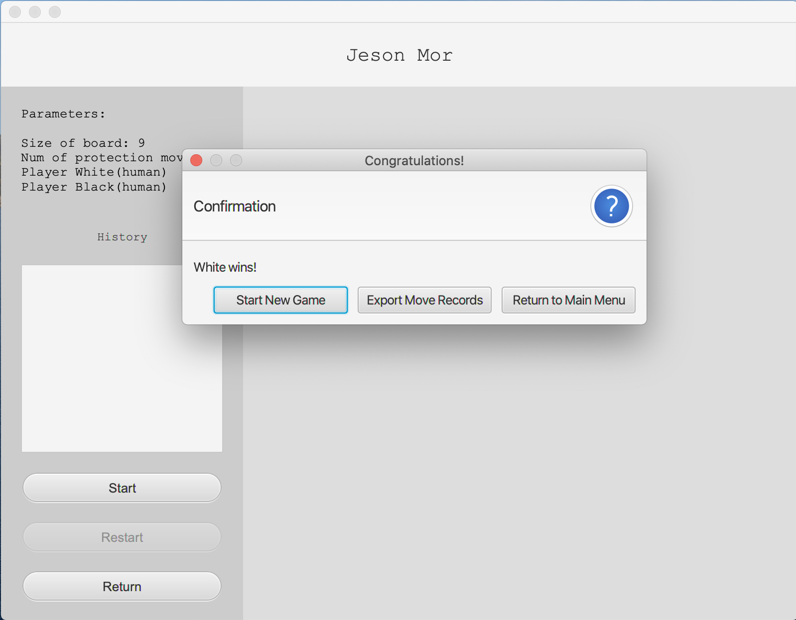


#### E. Export move records to file

When the game ends, the record of this game can be exported to a file.


#### F. Return to main menu

When clicking "Return" button, a confirmation window shows up to ask again.


### Function 2. Setting

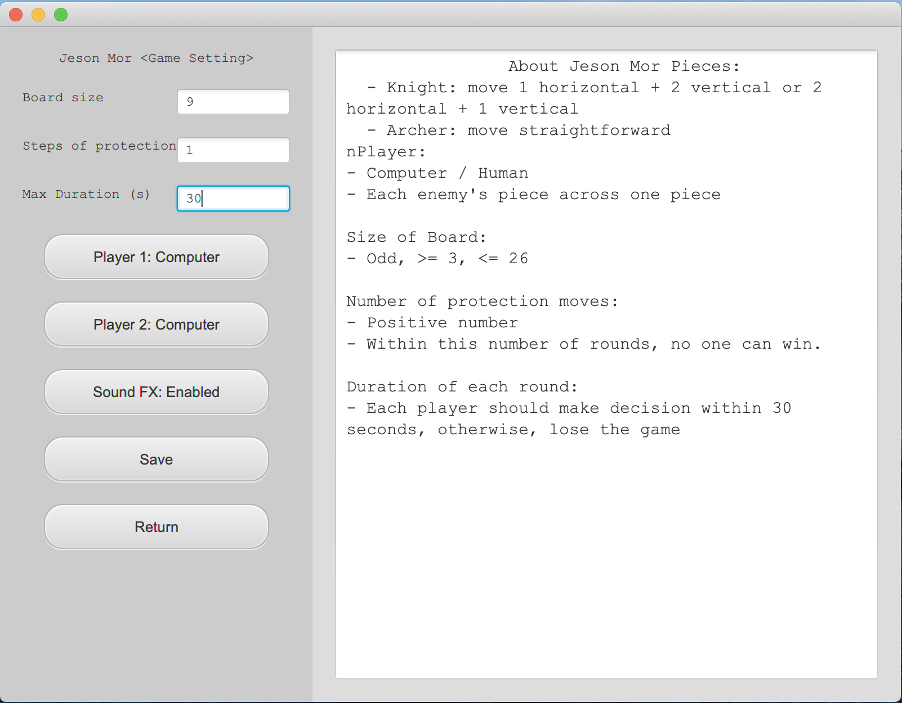


On this pane, the default board size, steps of protection and **max duration (optional)** can be edit. The role of players and sound effect can be also turned by clicking to flip.


### Function 3. History Record Validation

This function is to validate the record of the game, checking whether the configuration of the game, moves, scores are valid.
Two template records are provided under `src/main/records`. `template_correct_record.txt` is a correct one, 
`template_incorrect_record.txt` is an incorrect one with odd board size.

#### A. File Loading

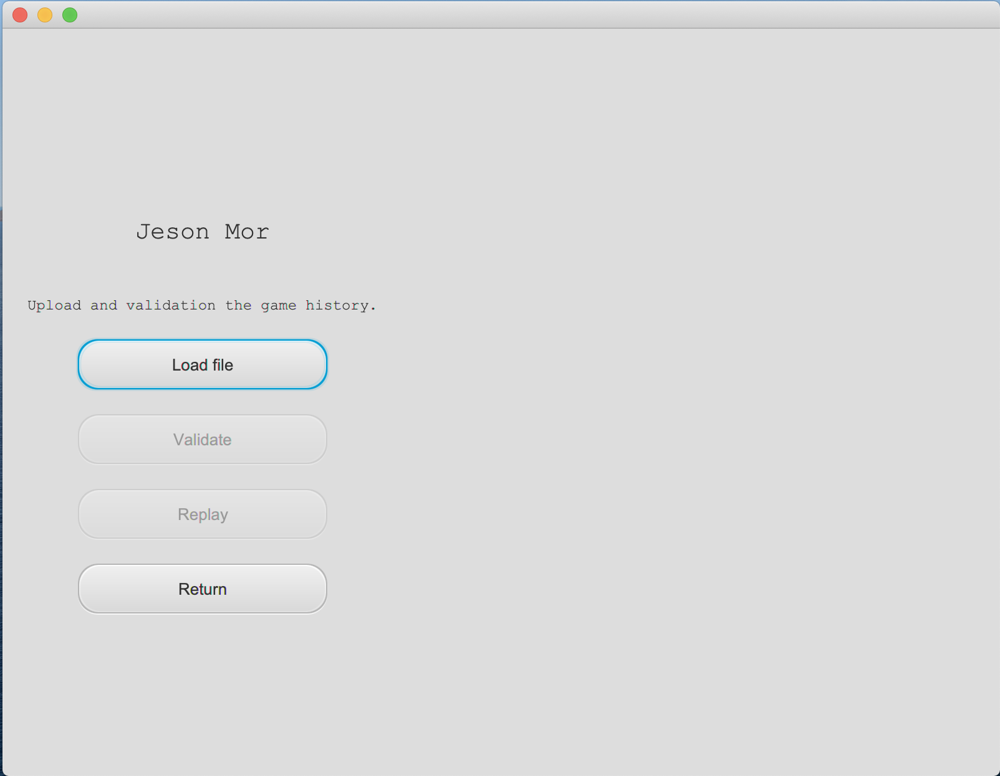


After loading the file, 

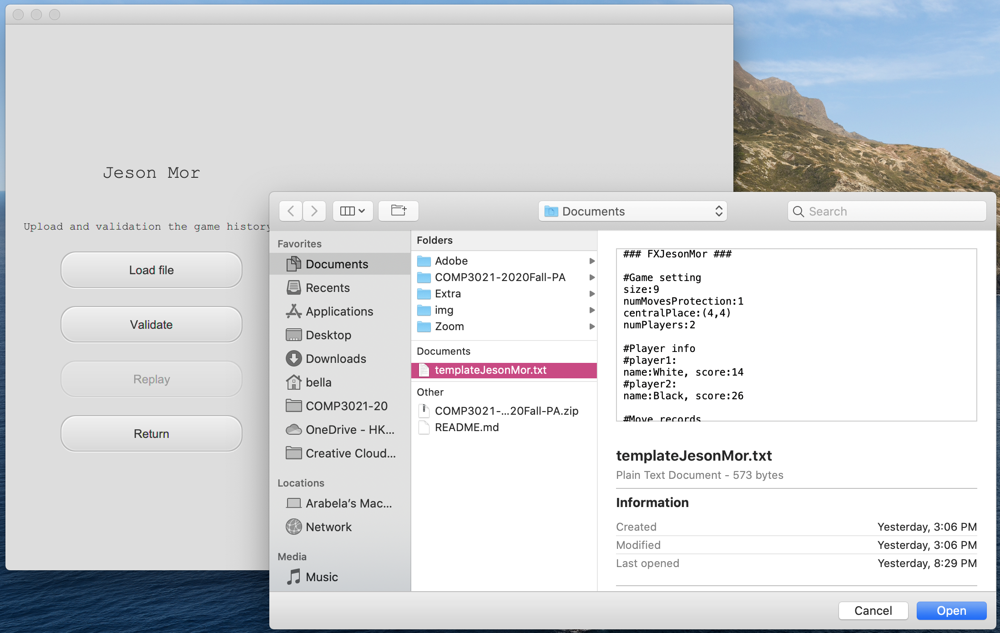


#### B. Validation

After file is loaded, validate this record and pop up information to show whether it is valid.

- **Validation passes**


- **Validation fails**

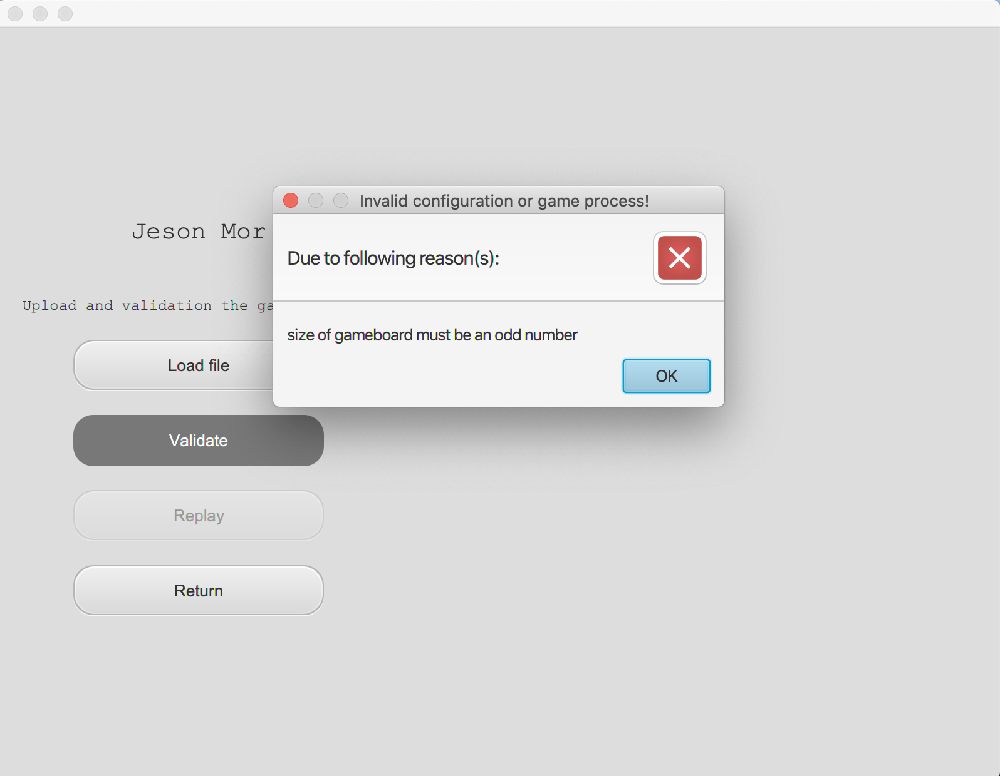


#### C. Replay

If the record passes the validation, the game process can be replayed.

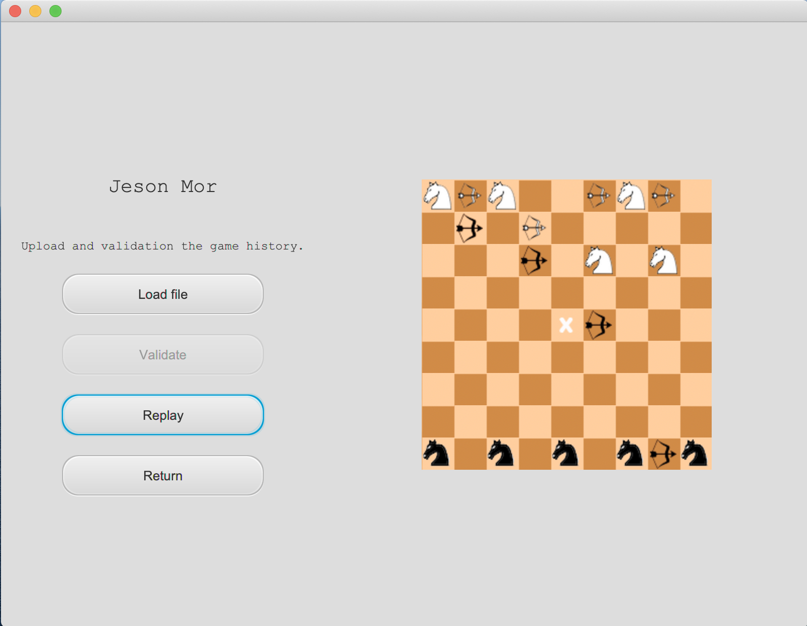


## Related Java Concepts

### `java.nio.file` Classes

Since Java 8, Java provides a collection of classes under the `java.nio.file` package to complement the existing file-related classes under the `java.io` package. 

In particular, we will be using these classes in conjunction with  the `Stream<T>` class to allow for more expressive and efficient code.

### `java.lang.Class<T>` Class

In the provided skeleton of `controllers.SceneManager`, you may notice the use of the `Class<T>` class.

`Class<T>` class ([JavaDoc](https://docs.oracle.com/en/java/javase/14/docs/api/java.base/java/lang/Class.html)) is a representation of a class in Java. This class is powerful due to its ability to provide information about a class, 
including its name, methods, member fields, constructors, etc. In addition, it also allows for *reflection*, i.e., the  ability to modify classes during runtime.

However in PA2, we **do not need to** use these features. 

**Instead**, we will use a `Class` to `Scene` **map** to easily switch between different scenes with one method. 


### Java Module System and JavaFX

Since Java 9, Java has introduced a module system to better modularize different components of a library.

Using this project as an example, under the `src/main/java` directory you will see the `module-info.java` file. This file is used 
to declare the **properties** of this module.

#### Declare Module name

```java
module castle.comp3021.assignment;
```

Simply declares this **module** to be named as `castle.comp3021.assignment`.

#### Declare Dependency

```java
requires javafx.controls;
requires javafx.media;
```

This statement declares that `javafx.controls` is a dependency of this module. In other words, JVM will try to find 
this module in the module path when loading. This replaces the old method of having to specify additional libraries in 
the classpath.

#### Declare Expose  

```java
exports castle.comp3021.assignment.gui;
exports castle.comp3021.assignment.textversion;
```

This statement declares that our module will **expose** the package `gui` and `textversion` to other modules. The reason for this is when 
the `javafx.application.Application.launch` is invoked, JavaFX will use reflection to call our overridden `Application.start` method. However, since the `main` package is not exported, JVM will throw an exception indicating that only exported packages can be accessed.

Alternatively, one may also declare the entire package to be an `open module`. However, this is considered poor design as this will allow all packages to be accessed externally, breaking **encapsulation**.

### `java.lang.Thread`/`java.util.TimerTask` Classes

The `Thread` class ([JavaDoc](https://docs.oracle.com/en/java/javase/12/docs/api/java.base/java/lang/Thread.html)) is an abstract representation of a system thread. Java allows different threads to be run simultaneously.

In a single-threaded Java application (such as your PA1), only the `Main Thread` will be running. With the addition of 
JavaFX in PA2, a new thread called `JavaFX Application Thread` will also be running concurrently. The purpose of the 
Application Thread is to specifically handle UI-related updates at its own pace, which has the benefit of keeping the UI
responsive while the background thread(s) handle computational heavy tasks. Android also uses a similar pattern, forcing
all UI operations to be executable by the UI thread.

`TimerTask` ([JavaDoc](https://docs.oracle.com/en/java/javase/12/docs/api/java.base/java/util/TimerTask.html)) uses the `Thread` class to execute a method without blocking other threads.


## Student Task

Complete all the **TODOs** in the entire project. 

***\*Note: You may need to add more methods to achieve your goal. No test cases are provided. The grade can be divided into two parts: GUI demonstration (major) and code style.*** 


A detailed description of each task is provided in the **Javadoc** **above each method**. 

In IntelliJ IDEA, go to `View > Tool Windows > TODO` to jump to each TODO in the project. You may replace the placeholder implementation in the methods marked as TODO.

| TODO                         | Practiced Concepts                  |
| ---------------------------- | ----------------------------------- |
| `AudioManager::playFile`     | JavaFX Media, Threads               |
| `Renderer::*`                | JavaFX Graphics                     |
| `ResourceLoader::*`          | Static Initialization, JavaFX Image |
| `SceneManager::SceneManager` | JavaFX Styling                      |
| `SceneManager::showPane`     | Java Maps, Class                    |
| `DurationTimer::*`           | Timer, Callback Design Pattern      |
| `*Pane::*`                   | JavaFX Controls, Styling            |
| `GameplayInfoPane::bindTo`   | JavaFX Bindings                     |
| `Serializer::*`              | File I/O, JavaFX File Utilities     |
| `Deserializer::*`            | File I/O, JavaFX File Utilities     |

All methods not mentioned in the above list practices concepts already visited in PA1.


***Hint***

*It is recommended to start from `SceneManager.java`, `ResourceLoader.java` and `MainMenuPane.java` so that you can get the scenes displayed.*


## Assignment Specification

Most of TODOs are under `/src/main/java/castle/comp3021/assignment/gui` . 

#### Controllers

This folder (`gui/controllers`) maintains the controllers for playing audio, rendering, loading resources and managing scenes.

##### *AudioManager* (`gui/controllers/AudioManager.java`)

Play the corresponding `.mp3` audio when some actions are activated. The resources can be found at `main/resources/assets/audio`. 

The are **three <u>compulsory</u> voices** need to play:

- When a piece is selected (mouse click): `click.mp3`
- When a piece is moved (mouse release and the move is valid): `place.mp3`
- Winner comes out: `win.mp3`

Three **optional** voices are also provided, you can use them as you like:

- When a player runs out of time: `lose.mp3`
- When a piece is moving: `move.mp3`
- When an enemy is killed: `kill.mp3`.


##### ***Renderer(`gui/controllers/Renderer.java`)***

Render the necessary graphics on the canvas or GraphicsContext. 


***ResourceLoader(`gui/controllers/ResourceLoader.java`)***

Load image resources. The image resources can be found at `main/resources/assets/images`. 


##### ***SceneManager(`gui/controllers/SceneManager.java`)***

Manage and show scenes and panes. 


#### Views

This folder (`gui/views`) defined the views of all panes, canvas and basic components.

##### ***BigButton(`gui/views/BigButton.java`)***

Define the style of big button, extending `Button`.


##### ***BigVBox(`gui/views/BigVBox.java`)***

Define the style of big vertical box, extending `VBox`.


##### ***NumberTextField(`gui/views/NumberTextField.java`)***

Define the style of text field that will be used, extending `TextField`.


##### ***Transition between panes***

The panes are defined under `gui/views/panes`. The names and the transition between them are shown below.

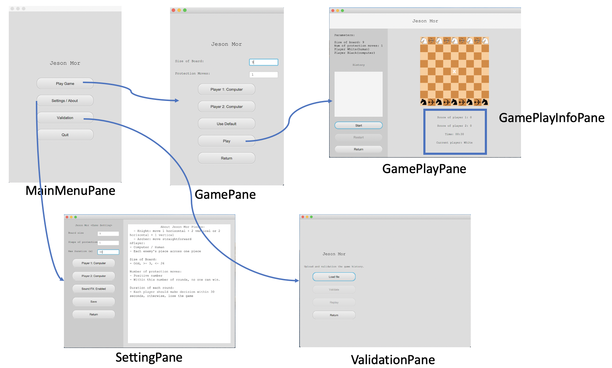

The functions of each pane are demonstrated in `Sec 2`(How it works), with one exception - ***GamePlayPane***

The implementation of how player changes in GamePlayPane is not specified, you can do it either automatically or manually:

- **Manually** player changes: once the previous player has finished the move, click "next" button to pass the control of the game to the next player.

More weights will be given if you implement


You also need implement the **automatic change** player when the previous player has made the move.


## Bonus

### Bonus Task 1 - Countdown timer.

Instead of recording time elapsed, implement the **countdown** timer which counts down from the maximum duration for each player (default: 30 seconds, can be set in `gui/DurationTimer.java`) to 0 second. If the current player runs out of time, then he/she loses the game.


### Bonus Task 2 - Automatic player change.

**Automatically** player changes: once the previous player has finished the move, the control of the game will be **automatically** passed to the next player without clicking extra buttons.


### Bonus Task 3 - Smarter Random Player

In PA1, the computer player adopts a random strategy. For PA2 bonus, you can come up with a **smarter** strategy for random player. You need to explain your strategy and implement it.


*Note: the strategy should involve the random part, which means you **cannot specify** what is every next move.*


## Obfuscated Version

We provide an obfuscated demo program which implements a GUI version of PA1. 
The demo program can be found at `artifacts/PA2_obfuscated.jar`.

Usage: (**NOTE: Change the javafx sdk path** according to your operation system!)
```
 java --module-path ./javafx-sdk-15-osx/lib --add-modules javafx.controls,javafx.media,javafx.graphics -jar artifacts/PA2_obfuscated.jar
```


Or using text version:

```
java --module-path ./javafx-sdk-15-osx/lib --add-modules javafx.controls,javafx.media, -jar artifacts/PA2_obfuscated.jar --text 9 1
 --text 9 1
```

where 9 represents board size, 1 stands for the number of protection steps. The two arguments for text version is the same as PA1.


## Code Style

Maintaining [a good code](https://google.github.io/styleguide/javaguide.html) style in Java program is good practice for a developer. 
To help you practise good code style in Java programs, we provide a jar application to check the code style of your
 code. 

Usage: 
```
java -jar artifacts/checkstyle-8.36-all.jar -c artifacts/style_checks.xml com.puppycrawl.tools.checkstyle.gui.GUIMain src
```
If your code contains any bad code style, errors will show up with detailed information. 

Note that good code style is also a part of your grade in this assignment. 


## Submission Requirements

### Submission

Your submission is a zip file including: 

* The Java project. Please maintain the original file structure. 
* A `github_url.txt` file containing the url of your **private** repository. We will ask you to add TAs' accounts as collaborators.


You need to submit your zip file in [CASS](https://cssystem.cse.ust.hk/UGuides/cass/index.html) (not CANVAS).
As well as push on your github repository before DDL!

The deadline of assignment 1 is **`7 Nov. 2020, 23:55`**. 


### GUI demonstration

Every student will be asked to reserve a **10 - 15 minutes slot for GUI demonstration** on zoom with TAs.


## Plagiarism

Do remember not to violate the following rules, otherwise it would be considered as an act of plagiarism.

* You must not share your codes with your classmates.
* You must not copy codes from your classmates.
* You must keep your Github Repository **Private** all the time. 

We will conduct code plagiarism tests on your program, and your grade will be deducted according to the [Honor
 Code](https://course.cse.ust.hk/comp3021/#HonorCode) if any extent of code plagiarism is found. 


## Grading Scheme

|                            | Percentage  | Remark                                                                    |
|----------------------------|-------------|---------------------------------------------------------------------------|
| Keep your Github repository private                 | 5%         | You must keep your repository private all the time.                        |
| At least 3 commits in different days                 | 5%         | You must commit in **three** **different** days in your repository.                        |
| GUI demonstration | 80%   | Pass the specific demo tasks |
| Code Style                 | 10%         | Get 10% if no error in code style checking. Deduct 1% for each 5 errors.  |
| Bonus Task 1: Countdown timer | Up to 5%   |  Work correctly                |
| Bonus Task 2: Automatic player changes | Up to 5%    | Work correctly |
| Bonus Task 3: Smarter random strategy | Up to 5%    | Make reasonable explanation and work correctly |

Final grade for PA2 = **min**(100, sum of above).
